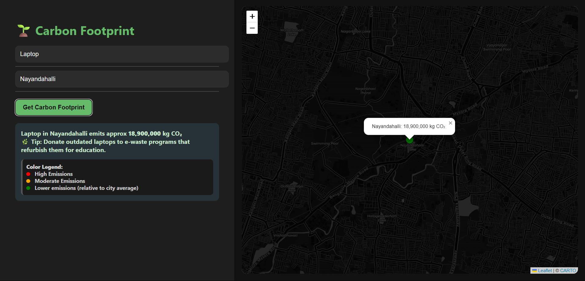

# 🌱 Carbon Footprint Estimator

A lightweight MVP web app built for the **Walmart Sparkathon 2025**, allowing users to estimate the carbon footprint of a product based on their locality. It also visualizes footprint data on a map and suggests eco-friendly tips per product.

## 🌐 Live Demo & Walkthrough

🔗 **Live App**: [Launch Carbon Nudge](https://carbonnudge.netlify.app/)  
🎥 **Demo Video**:  [Watch on YouTube](https://youtu.be/HVe75B8KJ8U)

## 🔍 Features

- 🌍 Estimate carbon footprint based on product + locality combo.
- 📍 Visualize footprint on an interactive Leaflet.js map (with dark mode).
- 💡 Get random actionable eco-tips based on selected product.
- 🔎 Real-time autosuggestions with keyboard navigation (arrow keys + Enter).
- 🌒 Sleek dark UI with responsive layout.

## 🛠 Tech Stack

- HTML, CSS, JavaScript
- Leaflet.js for mapping
- OpenStreetMap (with CARTO dark tiles)
- DOM manipulation + vanilla JS (no frameworks)
- Geocoding via Nominatim API

## ⚠️ Disclaimer

This is a **hackathon-level MVP** built to demonstrate idea feasibility. All carbon emission data is **simulated using dummy logic**:

```bash
Footprint = Base Product Value × (Locality Multiplier / 10)
```

**Not intended for real-world environmental assessments.**

## 🚀 How to Run Locally

1. Clone or download this repository.
2. Open `index.html` in your browser — no server setup required.
3. Type a product and locality, select from suggestions using arrow keys, and click “Get Carbon Footprint.”
4. View results and the map instantly.

## 🔮 Future Enhancements
To scale this MVP into a production-grade environmental tool, the following enhancements can be considered:

### 📊 Heatmap Visualization
Replace single-point map markers with granular heatmaps using regional carbon intensity.

Support zoom-level-based density overlays for cities, states, and countries.

Use Leaflet Heat plugin or D3.js overlays on top of the map.

### 🌍 Expanded Geography
Extend support beyond Bengaluru to pan-India and potentially global cities.

Integrate population and carbon intensity datasets via APIs or public CSVs.

### 🔌 Real Carbon Data Integration
Connect to supply chain emissions APIs or public carbon lifecycle datasets.

Example: OpenLCA, ecoinvent, Climate TRACE, etc.

### ⚙ Backend Integration
Migrate product-locality data to a Node.js / Firebase / Flask backend.

Enable user authentication, preferences, and usage tracking.

### 📈 User Dashboard
Allow users to view historical emissions, get weekly tips, or set reduction goals.

Provide gamification elements for eco-friendly behavior.

### 💬 Natural Language Input
Add a simple LLM interface to allow inputs like:

“How much CO₂ does a T-shirt in Koramangala emit?”

### 🧠 ML-Based Autocomplete
Replace prefix-based suggestions with machine learning-driven typeahead.

Use TF-IDF or embedding-based search models for fuzzy matches and intent prediction.

### 📱 Mobile Responsiveness
Improve layout and controls for mobile users.

Consider building a React Native version or PWA.

### 🎨 Accessibility & UX
Add screen reader support, contrast tuning, and keyboard-first UX.

Display product images, bar graphs, and animations for enhanced clarity.

## 📸 Preview 
Example:
  

## 👩‍💻 Author & Contributors
- 💻 **Aleena** – JavaScript, Logic, Map Integration, Architecture  
- 🎨 **Dhanushya S** – CSS Design & Styling  
- 🧩 **Babina Babu** – HTML Layout & UI Structure

Built with 💚 for the Walmart Sparkathon 2025.

---

🔒 No data is stored. All calculations happen client-side.